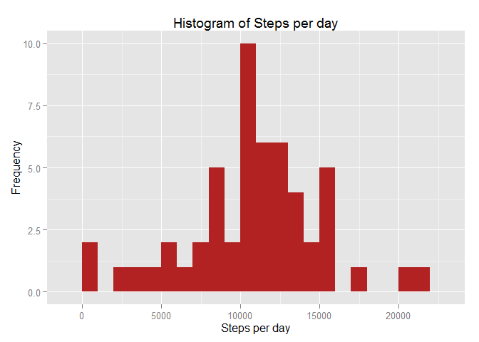
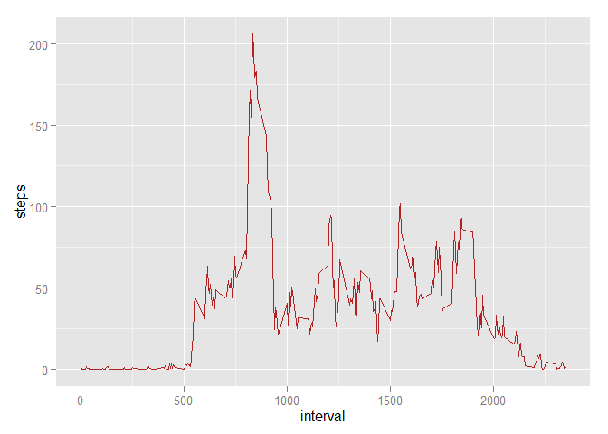
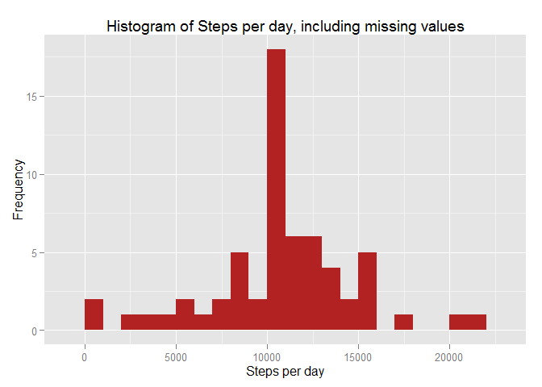
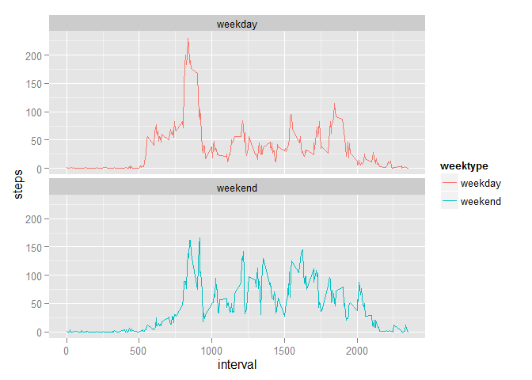

Introduction
============

This assignment makes use of data from a personal activity monitoring device. This device collects data at 5 minute intervals throughout the day. The data consists of two months of data from an anonymous individual collected during the months of October and November, 2012 and include the number of steps taken in 5 minute intervals each day.

This document presents the results from Project Assignment 1 in the Coursera course Reproducible Research, written in a single R markdown document that can be processed by knitr and transformed into an HTML file.

Loading necessary packages
--------------------------

``` r
library(dplyr)
```

    ## Warning: package 'dplyr' was built under R version 3.2.3

    ## 
    ## Attaching package: 'dplyr'

    ## The following objects are masked from 'package:stats':
    ## 
    ##     filter, lag

    ## The following objects are masked from 'package:base':
    ## 
    ##     intersect, setdiff, setequal, union

``` r
library(lubridate)
```

    ## Warning: package 'lubridate' was built under R version 3.2.3

``` r
library(ggplot2)
```

    ## Warning: package 'ggplot2' was built under R version 3.2.3

Loading and preprocessing data
------------------------------

Reading data, assuming that the csv file is in current working directory

``` r
data <- read.csv("activity.csv", header = TRUE, sep = ',', colClasses = c("numeric", "character", "integer"))
```

Changing date to into date format

``` r
data$date <- ymd(data$date)
```

Getting a feel of the data with str() and head()

``` r
str(data)
```

    ## 'data.frame':    17568 obs. of  3 variables:
    ##  $ steps   : num  NA NA NA NA NA NA NA NA NA NA ...
    ##  $ date    : POSIXct, format: "2012-10-01" "2012-10-01" ...
    ##  $ interval: int  0 5 10 15 20 25 30 35 40 45 ...

``` r
head(data)
```

    ##   steps       date interval
    ## 1    NA 2012-10-01        0
    ## 2    NA 2012-10-01        5
    ## 3    NA 2012-10-01       10
    ## 4    NA 2012-10-01       15
    ## 5    NA 2012-10-01       20
    ## 6    NA 2012-10-01       25

What is mean total number of steps taken per day?
-------------------------------------------------

Calculating total number of steps per day

``` r
steps <- data %>%
  filter(!is.na(steps)) %>%
  group_by(date) %>%
  summarize(steps = sum(steps)) %>%
  print
```

    ## Source: local data frame [53 x 2]
    ## 
    ##          date steps
    ##        (time) (dbl)
    ## 1  2012-10-02   126
    ## 2  2012-10-03 11352
    ## 3  2012-10-04 12116
    ## 4  2012-10-05 13294
    ## 5  2012-10-06 15420
    ## 6  2012-10-07 11015
    ## 7  2012-10-09 12811
    ## 8  2012-10-10  9900
    ## 9  2012-10-11 10304
    ## 10 2012-10-12 17382
    ## ..        ...   ...

Using ggplot to make a histgram

``` r
ggplot(steps, aes(x = steps)) +
  geom_histogram(fill = "firebrick", binwidth = 1000) +
  labs(title = "Histogram of Steps per day", x = "Steps per day", y = "Frequency")
```

<!-- -->

Calculating mean and median steps taken per day

``` r
mean_steps <- mean(steps$steps, na.rm = TRUE)
median_steps <- median(steps$steps, na.rm = TRUE)
```

``` r
mean_steps
```

    ## [1] 10766.19

``` r
median_steps
```

    ## [1] 10765

Mean steps are 10766 and median steps are 10765.

What is the average daily activity pattern?
-------------------------------------------

Calculating the average number of steps taken in each 5-minute interval per day

``` r
interval <- data %>%
  filter(!is.na(steps)) %>%
  group_by(interval) %>%
  summarize(steps = mean(steps))
```

Using ggplot to make the time series of the 5-min interval and avg. steps taken

``` r
ggplot(interval, aes(x=interval, y=steps)) +
  geom_line(color = "firebrick")
```

<!-- -->

Using which.max() to find out max steps on an average, accross all days

``` r
interval[which.max(interval$steps),]
```

    ## Source: local data frame [1 x 2]
    ## 
    ##   interval    steps
    ##      (int)    (dbl)
    ## 1      835 206.1698

The interval 835 has, on average, the max steps, with 206 steps.

Inputing missing values
-----------------------

Summarizing all missing values

``` r
sum(is.na(data$steps))
```

    ## [1] 2304

There are 2304 missing values

I'm using the average number of steps in a 5-min interval to fill in corresponding missing values

Creating a duplicate of the original dataset and filling in missing values in the duplicate dataset

``` r
data_full <- data
nas <- is.na(data_full$steps)
avg_interval <- tapply(data_full$steps, data_full$interval, mean, na.rm=TRUE, simplify=TRUE)
data_full$steps[nas] <- avg_interval[as.character(data_full$interval[nas])]
```

Checking to see if there are still any missing values

``` r
sum(is.na(data_full$steps))
```

    ## [1] 0

There are no more missing values

Calculating number of steps taken in each interval per day using the dataset created above (with no missing values)

``` r
steps_full <- data_full %>%
  filter(!is.na(steps)) %>%
  group_by(date) %>%
  summarize(steps = sum(steps)) %>%
  print
```

    ## Source: local data frame [61 x 2]
    ## 
    ##          date    steps
    ##        (time)    (dbl)
    ## 1  2012-10-01 10766.19
    ## 2  2012-10-02   126.00
    ## 3  2012-10-03 11352.00
    ## 4  2012-10-04 12116.00
    ## 5  2012-10-05 13294.00
    ## 6  2012-10-06 15420.00
    ## 7  2012-10-07 11015.00
    ## 8  2012-10-08 10766.19
    ## 9  2012-10-09 12811.00
    ## 10 2012-10-10  9900.00
    ## ..        ...      ...

Using ggplot to make the histogram

``` r
ggplot(steps_full, aes(x = steps)) +
  geom_histogram(fill = "firebrick", binwidth = 1000) +
  labs(title = "Histogram of Steps per day, including missing values", x = "Steps per day", y = "Frequency")
```

<!-- -->

Calculating mean and median steps taken per day with the filled in values

``` r
mean_steps_full <- mean(steps_full$steps, na.rm = TRUE)
median_steps_full <- median(steps_full$steps, na.rm = TRUE)
```

``` r
mean_steps_full
```

    ## [1] 10766.19

``` r
median_steps_full
```

    ## [1] 10766.19

The impact of imputing missing data with the average number of steps in the same 5-min interval is that both the mean and the median are equal to the same value: 10766.

Are there differences in activity patterns between weekdays and weekends?
-------------------------------------------------------------------------

Creating a new column in the filled dataset to identify whether a given day is weekday or weekend

``` r
data_full <- mutate(data_full, weektype = ifelse(weekdays(data_full$date) == "Saturday" | weekdays(data_full$date) == "Sunday", "weekend", "weekday"))
data_full$weektype <- as.factor(data_full$weektype)
head(data_full)
```

    ##       steps       date interval weektype
    ## 1 1.7169811 2012-10-01        0  weekday
    ## 2 0.3396226 2012-10-01        5  weekday
    ## 3 0.1320755 2012-10-01       10  weekday
    ## 4 0.1509434 2012-10-01       15  weekday
    ## 5 0.0754717 2012-10-01       20  weekday
    ## 6 2.0943396 2012-10-01       25  weekday

Calculating avg steps in the 5-min interval

``` r
interval_full <- data_full %>%
  group_by(interval, weektype) %>%
  summarise(steps = mean(steps))
```

Using ggplot to make a comparitive time series of 5-min interval for weekdays and weekends

``` r
s <- ggplot(interval_full, aes(x=interval, y=steps, color = weektype)) +
  geom_line() +
  facet_wrap(~weektype, ncol = 1, nrow=2)
print(s)
```

<!-- -->

From the two plots it appears that the test object is more active earlier in the day during weekdays compared to weekends, but more active throughout the weekends compared with weekdays (probably because the oject is working during the weekdays, hence moving less during the day).
